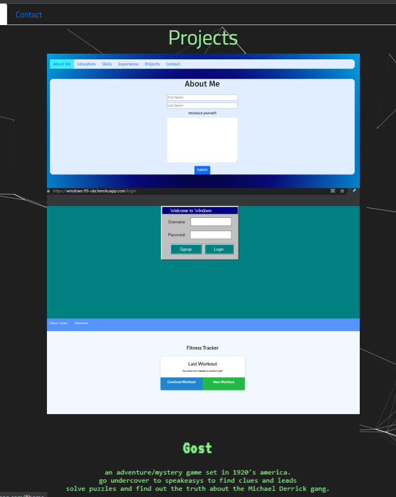

# Personal Portfolio

[Github](https://github.com/evan-ebert17/PersonalPortfolioREDUX/)  
[Deployed React App](https://eeportfolio.herokuapp.com/)

## Screen Shots

##### Table of Contents  
[Purpose](#purpose)  
[Features](#features)  
[Technologies Used](#technologies-used)  
[Installation](#installation)  
[Usage](#usage)  
[Credits](#credits)  
[License](#license)  

## Purpose  
This is my personal porfolio after all of UTA MERN Bootcamp. Over the course of the UTA MERN Bootcamp we have done projects and honed our skills to become will stack web developers. Now that the course has ended, this is a React portfolio comprising of all the projects and assignments I am most proud of.

## Features 
Clicking the tabs to go from page to page of my portfolio.

## Technologies-Used  
This project was made possible with React, React-Bootstrap, JavaScript, HTML5+CSS and React-Particles-Js.  

## Installation  
There is no need to install this application for use, because it is hosted at the links provided above. However, for code inspection or etc, if you have SSH Keys linked, you can simple use your terminal and clone the repo down, otherwise, the typical zip.

## Usage  
There are tabs at the top of the page that you can click to go to the tabs of the application, each corresponding to an obvious portion of the application.
For the projects tab, when you hover over the images in this section you are presented with a button that takes you to the github repository.

## Credits
This project was made by  
[Evan Ebert](https://github.com/evan-ebert17)

## License

Copyright 2021 Evan Ebert

Permission is hereby granted, free of charge, to any person obtaining a copy of this software and associated documentation files (the "Software"), to deal in the Software without restriction, including without limitation the rights to use, copy, modify, merge, publish, distribute, sublicense, and/or sell copies of the Software, and to permit persons to whom the Software is furnished to do so, subject to the following conditions:

The above copyright notice and this permission notice shall be included in all copies or substantial portions of the Software.

THE SOFTWARE IS PROVIDED "AS IS", WITHOUT WARRANTY OF ANY KIND, EXPRESS OR IMPLIED, INCLUDING BUT NOT LIMITED TO THE WARRANTIES OF MERCHANTABILITY, FITNESS FOR A PARTICULAR PURPOSE AND NONINFRINGEMENT. IN NO EVENT SHALL THE AUTHORS OR COPYRIGHT HOLDERS BE LIABLE FOR ANY CLAIM, DAMAGES OR OTHER LIABILITY, WHETHER IN AN ACTION OF CONTRACT, TORT OR OTHERWISE, ARISING FROM, OUT OF OR IN CONNECTION WITH THE SOFTWARE OR THE USE OR OTHER DEALINGS IN THE SOFTWARE.
